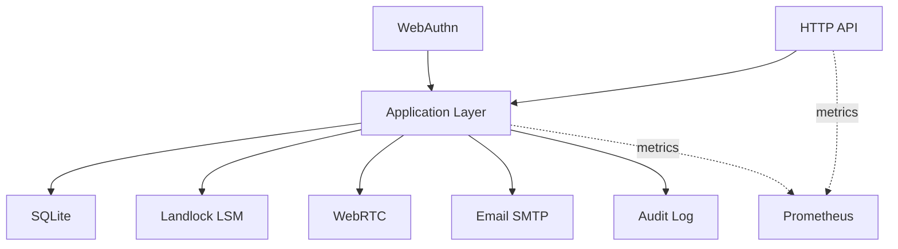

# Adapters Documentation

This directory contains detailed documentation for each adapter in the system.

**Adapters** are the outermost layer in hexagonal architecture, responsible for integrating with external systems and technologies.

---

## Adapter Types

### Primary Adapters (Driving/Input)
Adapters that receive requests from outside and drive the application:

- **[HTTP API](http.md)** - REST API endpoints (Actix-Web/Axum)
- **[WebAuthn](webauthn.md)** - Passwordless authentication (FIDO2)

### Secondary Adapters (Driven/Output)
Adapters that the application uses to interact with external systems:

- **[SQLite](sqlite.md)** - Relational database persistence
- **[Landlock LSM](landlock.md)** - Linux kernel security enforcement
- **[WebRTC](webrtc.md)** - Real-time video streaming
- **[HAProxy](haproxy.md)** - Reverse proxy integration
- **[Email](email.md)** - SMTP email notifications
- **[Audit Log](audit.md)** - Hybrid logging (DB + filesystem)
- **[Monitoring](monitoring.md)** - Prometheus metrics

---

## Documentation Structure

Each adapter document includes:

1. **Purpose** - What the adapter does
2. **Technology** - External libraries/systems used
3. **Responsibilities** - Clear scope of the adapter
4. **Dependencies** - Required crates and configuration
5. **API/Interface** - How to interact with the adapter
6. **Data Model** - Entity structures and schemas
7. **Testing Strategy** - Unit, integration, and load tests
8. **Configuration** - Required settings
9. **Security Considerations** - Security best practices
10. **Performance** - Scalability and optimization notes

---

## Adapter Principles

### 1. Single Responsibility
Each adapter has ONE job:
- HTTP adapter: Handle HTTP requests/responses
- SQLite adapter: Persist/retrieve data
- Landlock adapter: Enforce filesystem access control

### 2. Technology Isolation
Business logic (domain layer) NEVER imports adapter-specific dependencies:
- ✅ Domain uses repository interfaces (ports)
- ❌ Domain does NOT import sqlx, actix-web, etc.

### 3. Testability
Adapters are tested independently:
- Unit tests: Adapter logic in isolation
- Integration tests: Adapter + external system
- Contract tests: Adapter implements port interface correctly

### 4. Swappability
Adapters can be replaced without changing business logic:
- Swap Actix-Web → Axum (HTTP framework)
- Swap SQLite → PostgreSQL (database)
- Swap SMTP → SendGrid (email provider)

---

## Adapter Dependencies

---

## Quick Reference

| Adapter | Technology | Port | Purpose |
|---------|-----------|------|---------|
| **HTTP** | Actix-Web/Axum | 8080 | REST API |
| **SQLite** | diesel | - | Data persistence |
| **Landlock** | Rust + syscalls | - | Filesystem access control |
| **WebRTC** | webrtc-rs | UDP | Video streaming |
| **HAProxy** | External | 443 | TLS termination + load balancing |
| **Email** | lettre | 587 | SMTP notifications |
| **Redis** | redis-rs | 6379 | Caching + sessions |
| **Prometheus** | prometheus-rs | 9090 | Metrics + monitoring |

---

## Development Order

Recommended implementation sequence:

1. **SQLite** - Basic data persistence
2. **HTTP API** - Core REST endpoints
3. **WebAuthn** - Authentication flow
4. **Landlock** - Security enforcement
5. **WebRTC** - Streaming capability
6. **Email** - Notifications
7. **Audit Log** - Compliance logging
8. **Monitoring** - Observability
9. **HAProxy** - Production deployment

---

**Last Updated**: 2026-02-14  
**Related**: [../../docs/ARCHITECTURE.md](../../docs/ARCHITECTURE.md), [../../docs/TESTING.md](../../docs/TESTING.md)
